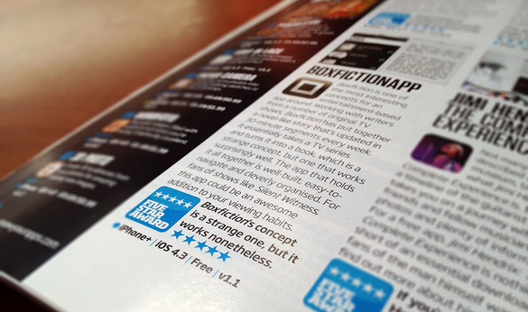

The unique service allows readers to purchase original stories written by leading TV writers in episode format similar to that of a TV show. Free pilots allow you to trial a series and in-app purchasing allows you to keep up to date with your favourite series wherever you are.

Partnering with the commissioned design agency, we developed the app for iPhone and iPad App Development. This included building the e-reader engine, server API and account integration..

## Awarded 5/5 Stars ⭐️⭐️⭐️⭐️⭐️

After launch the app received 5/5 stars from App Magazine.

> Boxfiction is one of the most interesting concepts for an entertainment-based app around. Working with writers from a number of TV shows, Boxfiction has put together a novel-like story that's updated in 30-minute segments every week.

> It essentially takes a TV series and turns it into a book, which is a strange concept, but one that works surprisingly well. The app that holds it together is well-built, easy-to-nevigate and cleverly organised. For fans of shows like Silent Witness, this app could be an awesome addition to your viewing habits.

[[Top]](#top)
