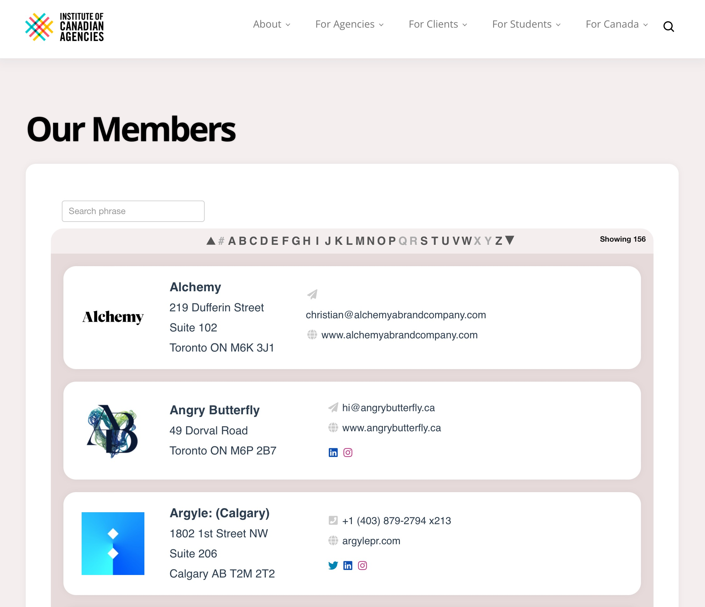
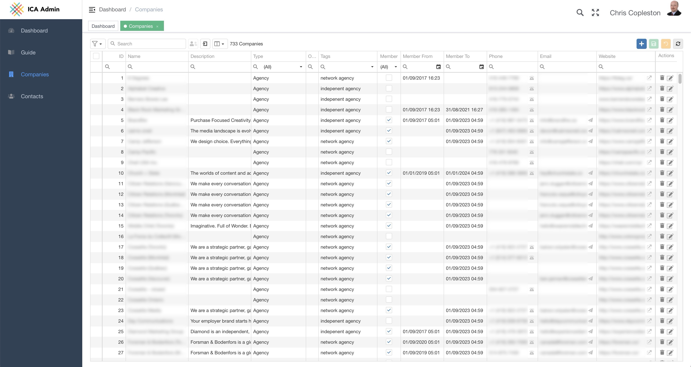
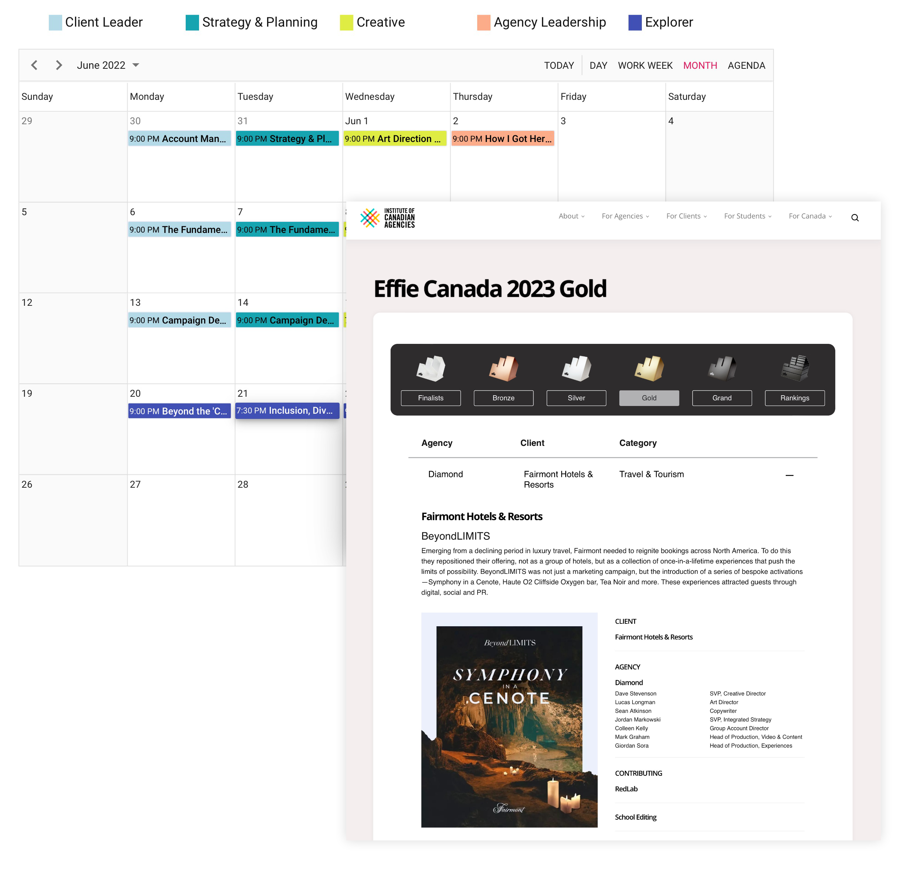

## In 2017 the ICA were looking to replace their outdated website, develop and integrate a bespoke membership and events system. We had worked with the new President & CEO for many years in the UK for the Marketing Agencies Association. With our proven track record, 4DPrime was commissioned without tender.

> I have worked with 4DPrime for over 15 years and both sides of the Atlantic. Their bespoke and business-like approach means getting to results and delivery quickly. They respond and create with a sense of purpose and urgency. The 4DPrime team certainly set the pace for ideas and client service standards

Scott Knox, President & CEO

### Website

Our creative team worked closely with the ICA to create a friendly and dynamic home for ICA Members, Marketing Agency Customers and Students of the industry.

#### Membership Directory

Member Agencies can easily be located and contacted through their ICA Profile.

### Customer Relationship Manager

We developed a powerful CRM for ICA staff to update and communicate with their member agencies. With grouping, filtering and view customisation, data can easily be exported to Excel, drive email marking campaigns and control the Membership Directory. Under the hood, servers are load-balanced and highly secure to ensure the systems are scalable and hacker resilient.

### Events and awards

The ICA host both training and industry award events. We developed an events system that can schedule events and an award system that can track the process of entry submission, judging and winner announcements as well as event streaming and playback.

