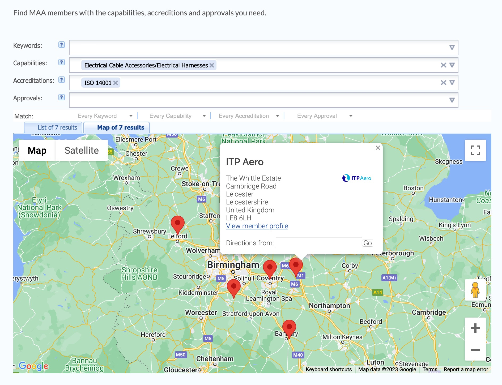
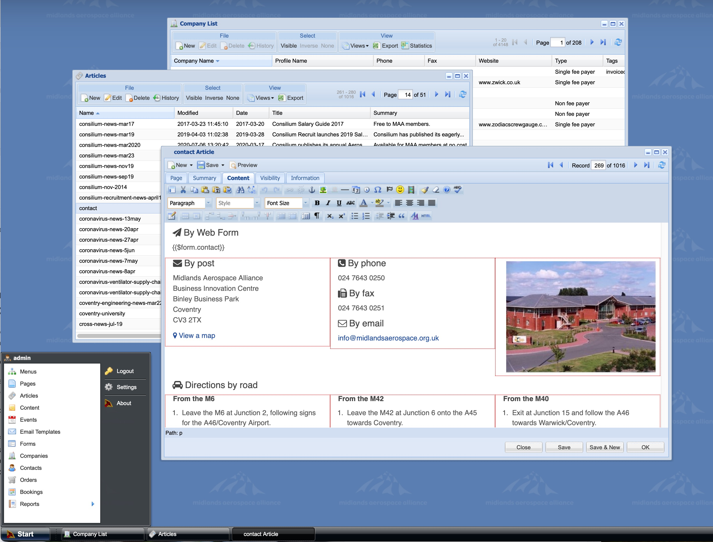
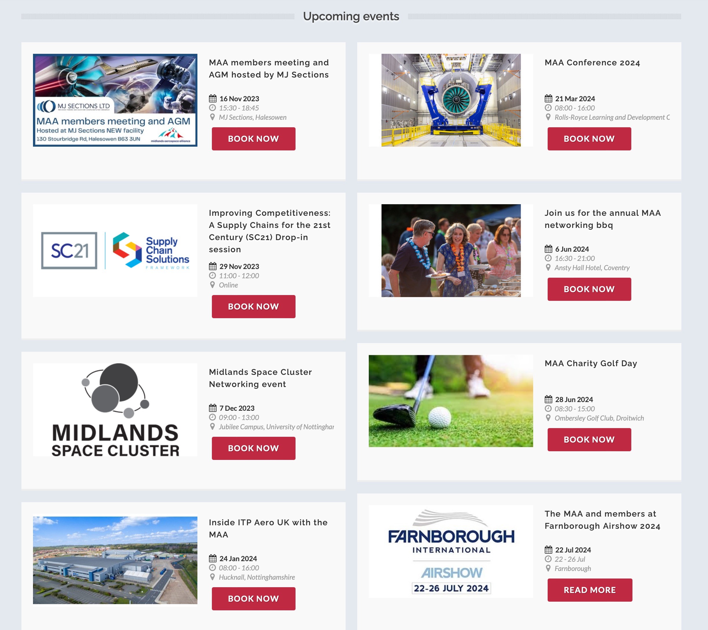

We have been looking after the MAA digital systems since 2005. During that time the website has undergone some refreshes to keep it relevant. The back-office systems remain as robust and reliable as ever.

## Website

The website promotes membership and events such as a Paris Airshow as well as industry news and services.

### Membership Directory

Aerospace titans can easily find suitable supply chain companies by keywords, capabilities, accreditation and approvals, as well as geographical location.

## Admin Portal

We developed a powerful Admin Portal for MAA staff to update and communicate with their member agencies, drive email marking campaigns and control the Membership Directory.

There is a fully integrated Content Management and Event Booking and e-commerce System.

Under the hood, servers are load-balanced and highly secure to ensure the systems are scalable and hacker resilient.

### Events

The MAA host training and industry events. The system easy booking with member and non-member pricing, attendee communication and an e-commerce payment platform.

