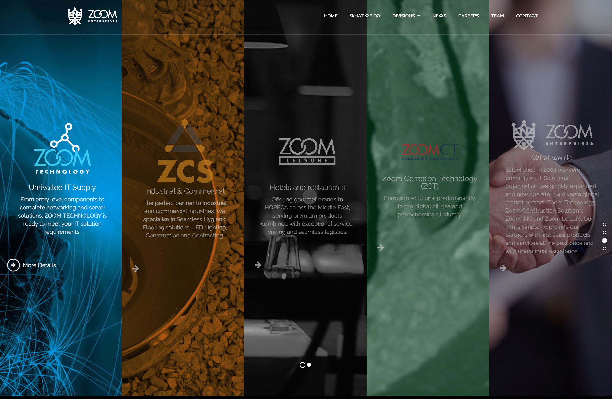

import { YouTube } from 'astro-lazy-youtube-embed'

## We have been looking after the Zoom Enterprises since 2004 and helped Zoom throughout their expansion, providing websites, creative media and email services.

### Motion Graphics

Our creative team crafted motion graphics promos for Zoom Enterprises. Here's an example.

  

    <YouTube
      class="rounded-2xl mx-8"
      embedParams={{ rel: 0, controls: 1, autoplay: 1 }}
      thumbnailRes="maxres"
      title="4DPrime - The Future of Digital Marketing"
      videoId="RaTyHDSIJs4"
    />
  

### Website

The website reflects the diverse business sectors of Zoom Enterprises, with micro-sites detailing each.

#### Micro-sites

Each division of Zoom Enterprises is represented by a micro-site that details the services that the division provides.

